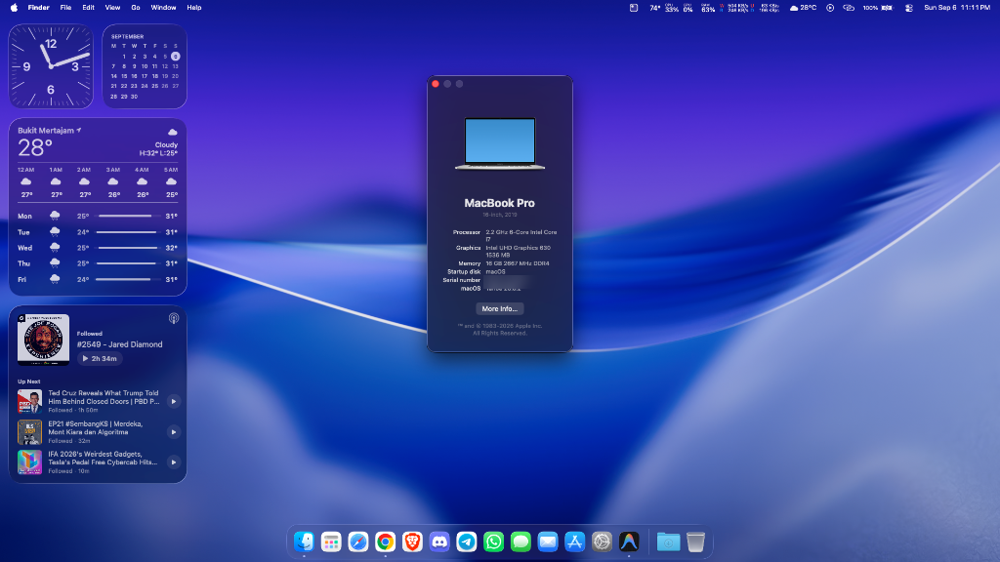

# ASUS ROG Strix GL503GE Hackintosh

[](https://github.com/acidanthera/OpenCorePkg)
[](https://www.apple.com/macos/)
[](https://rog.asus.com/)
[](https://github.com/blackosx/OpenCanopy-Icons)
[](LICENSE)

An optimized, production-ready OpenCore EFI configuration for running macOS (**Sonoma 14.x**, **Sequoia 15.x**, and **Tahoe 26.x**) on the **ASUS ROG Strix GL503GE** gaming laptop.

Built following the [Dortania OpenCore Install Guide](https://dortania.github.io/OpenCore-Install-Guide/), assisted by [OpenCore Simplify](https://github.com/lzhoang2801/OC-Simplify), and powered by [Acidanthera](https://github.com/acidanthera) kexts and drivers.

<p align="center">
  
  <br/>
  <i>macOS Tahoe running on ASUS ROG Strix GL503GE (Intel Core i7-8750H, Intel UHD Graphics 630, 16 GB DDR4)</i>
</p>

> [!WARNING]
> ### ⚠️ Legal Disclaimer & Terms of Use
> * **EULA Compliance:** Running macOS on non-Apple-branded hardware breaches Section 2B of Apple Inc.'s [macOS Software License Agreement (EULA)](https://www.apple.com/legal/sla/).
> * **Educational & Research Purpose:** This repository is an open-source research project provided strictly for personal experimentation, technical research, and non-commercial educational purposes under Fair Use.
> * **Zero Copyrighted Binaries:** This repository contains **no proprietary Apple code, copyrighted macOS operating system images, or Apple software distributions**. It distributes only open-source community bootloader components, SSDT hotpatches, and driver wrappers.
> * **Non-Affiliation:** This project is independent and is **not affiliated with, endorsed by, sponsored by, or supported by Apple Inc., ASUSTeK Computer Inc., Intel Corporation, NVIDIA Corporation, or any of their affiliates**.
> * **Limitation of Liability & Assumption of Risk:** You assume all risks. The authors and contributors shall not be held liable or responsible for any hardware damage, data loss, system instability, voided warranties, or Apple ID / iCloud account penalties resulting from the implementation or use of these files.

---

### 📌 Quick Navigation
[💻 Hardware Status](#-hardware-specifications--status) • [📂 EFI Structure](#-repository-structure) • [⚙️ OpenCore Config](#-opencore-configuration) • [🔧 BIOS Settings](#-bios-configuration) • [🚀 Installation](#-installation--setup-guide) • [🌐 Apple Services](#-apple-ecosystem--continuity) • [🔌 USB Port Map](#-physical-usb-port-mapping) • [📖 Troubleshooting](#-troubleshooting--optimizations) • [⚖️ Legal & Trademarks](#️-trademark-notices--legal)

---

## 💻 Hardware Specifications & Status

| Component | Hardware Details | Status | Notes / Drivers |
| :--- | :--- | :---: | :--- |
| **CPU** | Intel Core i7-8750H (Coffee Lake-H, 6c/12t) | ✅ Working | Native Power Management (`SSDT-PLUG`, `X86PlatformPlugin`) |
| **iGPU** | Intel UHD Graphics 630 | ✅ Working | Full QE/CI acceleration (2048 MB VRAM), complete modeset (`complete-modeset`), force online (`force-online`), instant backlight fix (`-igfxblr`), HDMI 2.0 |
| **dGPU** | NVIDIA GeForce GTX 1050 Ti (Mobile) | ❌ Disabled | Disabled via `SSDT-Disable_GPU_PEG0.aml` to save power and prevent heat |
| **RAM** | 16 GB DDR4 2666 MHz | ✅ Working | Dual-channel detected & operational |
| **Storage** | Samsung 980 500GB NVMe SSD | ✅ Working | Native APFS trim (`SetApfsTrimTimeout = 0`), power management via `NVMeFix.kext` |
| **Audio** | Realtek ALC (ALC295/294) | ✅ Working | `layout-id: 14` (`<data>DgAAAA==</data>`, `alcid=14`), internal speakers, internal mic, 3.5mm combo jack, HDMI audio (OCLP-Mod root patch on macOS 26 Tahoe) |
| **Boot Chime** | UEFI Audio Output | ✅ Working | Native startup chime via `AudioDxe.efi` (`OCEFIAudio_VoiceOver_Boot.wav`) |
| **Ethernet** | Realtek RTL8111 Gigabit Ethernet | ✅ Working | Handled by `RealtekRTL8111.kext` |
| **Wi-Fi** | Intel AX210 / Wireless-AC 9560 | ✅ Working | Supported via **OCLP-Mod** root patching (`IOSkywalkFamily` + `AMFIPass`) |
| **Bluetooth** | Intel Wireless Bluetooth | ✅ Working | Internal USB Port 14 (`HS14`), `IntelBluetoothFirmware` + `IntelBTPatcher` v2.5.1 + `BlueToolFixup` |
| **Trackpad** | ASUS I2C Multi-Touch Trackpad | ✅ Working | Smooth multi-touch gestures via `VoodooI2C` + `VoodooI2CHID` (Native GPIO interrupt mode) |
| **Keyboard** | Built-in Backlit Keyboard | ✅ Working | Function row keys (F1–F12) mapped via `./scripts/setup_function_keys.sh` |
| **RGB Lighting** | Aura 4-Zone RGB Lighting | ✅ Supported | Brightness (`Fn + Up/Down`) & effects controlled via [ROG Gaming Center for macOS](https://github.com/sritulasiram/rog-gaming-center-hackintosh) |
| **Webcam** | Built-in USB HD Camera | ✅ Working | Native macOS UVC support |
| **Card Reader** | Realtek RTS5229 PCIe SD Card Reader | 🔄 Supported | Handled by `Sinetek-rtsx.kext` (macOS Tahoe compatible; insert before boot/wake) |
| **Battery Status** | ASUS Smart Battery | ✅ Working | Real-time percentage & AC health via `SMCBatteryManager.kext` |
| **Display** | 15.6" Full HD 120Hz IPS Display | ✅ Working | Native brightness slider, 120Hz refresh rate |
| **HDMI Output** | HDMI 2.0 Port | ✅ Working | 4K video & audio output |
| **Sleep / Wake** | S3 Sleep State | ✅ Working | Sleep, lid close, and wake operational (`SSDT-GPRW`, `fix_sleep_pmset.sh`) |

---

## 🌐 Apple Ecosystem & Continuity

| Feature | Status | Notes |
| :--- | :---: | :--- |
| **Apple ID & iCloud** | ✅ Working | Full iCloud Drive, Keychain sync, Safari tabs, and Notes sync |
| **App Store & Updates** | ✅ Working | Native store access and app updates (`en0` set as `IOBuiltin`) |
| **iMessage & FaceTime** | ✅ Working | Operational when `ROM` in SMBIOS matches onboard Ethernet MAC address |
| **Handoff & Universal Clipboard** | ✅ Working | Active via Bluetooth LE (`IntelBTPatcher` + `BlueToolFixup`) and local Wi-Fi |
| **Instant Hotspot** | ✅ Working | Auto-discovers iPhone Personal Hotspot over BLE without touching phone |
| **Continuity Camera** | ⚠️ Wired Only | iPhone as 1080p/4K webcam works over USB cable; wireless requires AWDL |
| **AirPlay Receiver** | ⚠️ Local LAN | Works when devices share same Wi-Fi/Ethernet LAN; direct P2P requires AWDL |
| **AirDrop** | ❌ Unsupported | Intel Wi-Fi hardware lacks Apple Wireless Direct Link (**AWDL**) protocols |
| **Universal Control** | ❌ Unsupported | Requires Apple AWDL tunneling; physical Broadcom hardware required |
| **Apple Watch Auto Unlock** | ❌ Unsupported | Requires 802.11v Time-of-Flight (ToF) RTT nano-timestamping via AWDL |
| **Sidecar** | ❌ Unsupported | `MacBookPro16,4` delegates Sidecar encryption to physical Apple T2 chip |
| **iPhone Mirroring** *(macOS 15+)* | ❌ Unsupported | Strictly requires Apple Silicon or Intel Mac with physical Apple T2 chip |

---

## 🔌 Physical USB Port Mapping

All physical and internal USB ports are custom-mapped within macOS's 15-port per controller limit (14 ports total) using `USBToolBox.kext` and `UTBDefault.kext`:

| Port | Chassis Location | Connector Type | Speed | Connected Device / Function |
| :--- | :--- | :--- | :--- | :--- |
| **SS01 / HS01** | Left Side (Rear) | USB 3.0 Type-A | USB 3.0 (5 Gbps) | External storage, flash drives, high-speed peripherals |
| **SS02 / HS02** | Left Side (Middle) | USB 3.0 Type-A | USB 3.0 (5 Gbps) | External storage, mice, keyboards |
| **HS09 / HS11** | Left Side (Center) | Type-C w/o switch (Type 10) | USB 2.0 (480 Mbps) | USB-C audio, DACs, smartphones, flash drives (dual-orientation) |
| **SS03 / SS04** | Left Side (Center) | Type-C w/o switch (Type 10) | USB 3.1 (5 Gbps) | High-speed Type-C SSDs, flash drives (dual-orientation) |
| **HS03** | Right Side (Top) | USB 2.0 Type-A | USB 2.0 (480 Mbps) | Mouse dongles, flash drives, legacy peripherals |
| **SS05 / HS04** | Right Side (Bottom) | USB 3.0 Type-A | USB 3.0 (5 Gbps) | External storage, high-speed peripherals |
| **HS07** | Internal Header | Internal (Type 255) | USB 2.0 (480 Mbps) | ASUS HD USB Webcam |
| **HS08** | Internal Header | Internal (Type 255) | USB 2.0 (480 Mbps) | ITE 8910 Aura RGB Keyboard Microcontroller |
| **HS14** | Internal Header | Internal (Type 255) | USB 2.0 (480 Mbps) | Intel Bluetooth Controller (9560 / AX210) |

---

## 📂 Repository Structure

```text
.
├── .github/
│   └── workflows/              # Automated GitHub Actions build & release workflows
├── docs/
│   └── images/                 # Desktop screenshot and documentation assets
├── EFI/
│   ├── BOOT/
│   │   └── BOOTx64.efi         # OpenCore initial UEFI bootloader
│   └── OC/
│       ├── ACPI/               # 12 optimized DSDT/SSDT patches
│       ├── Drivers/            # UEFI drivers (AudioDxe, OpenCanopy, OpenRuntime, etc.)
│       ├── Kexts/              # 26 kernel extensions for hardware enablement
│       ├── Resources/          # Audio chimes, fonts, OpenCanopy themes & labels
│       │   ├── Audio/          # Startup chime WAV files
│       │   ├── Font/           # Boot picker typography
│       │   ├── Image/          # Icons (Acidanthera & Blackosx BsxM1 modern theme)
│       │   └── Label/          # Entry label bitmaps
│       └── config.plist        # Complete OpenCore configuration (sanitized)
├── LICENSE                     # MIT License
├── README.md                   # This documentation
└── TROUBLESHOOTING.md          # In-depth post-install and troubleshooting guide
```

---

## ⚙️ OpenCore Configuration

* **OpenCore Version:** `1.0.7`
* **Target SMBIOS:** `MacBookPro16,4`
* **Boot Arguments:**
  ```text
  debug=0x100 alcid=14 keepsyms=1 -amfipassbeta -igfxblr darkwake=0 -btlfxallowanyaddr -btlfxboardid
  ```
* **Boot Argument Breakdown:**
  * `alcid=14` — Selects AppleALC layout-id 14 for the Realtek ALC295/294 codec.
  * `-igfxblr` — Restores instantaneous backlight power at display driver attach without black screen delays.
  * `-amfipassbeta` — Allows AMFIPass to work on modern beta/new macOS versions.
  * `darkwake=0` — Disables maintenance darkwake cycles for rock-solid sleep stability.
  * `-btlfxallowanyaddr -btlfxboardid` — Bluetooth firmware upload compatibility flags for BlueToolFixup.
  * `debug=0x100 keepsyms=1` — Retains kernel symbols and prevents auto-reboot on kernel panic.

### 🎨 Graphical Boot Picker (OpenCanopy)
* **Mode:** `External`
* **Theme:** `Blackosx\BsxM1` (Modern Apple-style dark icons)
* **Attributes:** `144` (Enables high-resolution icons and direct label rendering)

### 🔊 UEFI Boot Chime (AudioDxe)
* **Driver:** `AudioDxe.efi`
* **Audio Device:** `PciRoot(0x0)/Pci(0x1f,0x3)`
* **Audio Codec:** `0`
* **Setup Delay:** `500 ms`
* **Audio File:** `OCEFIAudio_VoiceOver_Boot.wav` (Native Mac startup chime)

### 🧩 ACPI Patches (SSDTs)
* `SSDT-ALSD.aml` — Ambient Light Sensor dummy device.
* `SSDT-Disable_GPU_PEG0.aml` — Shuts down the discrete NVIDIA GTX 1050 Ti GPU.
* `SSDT-EC.aml` — Embedded Controller compatibility patch for macOS.
* `SSDT-GPI0.aml` — Enables GPIO controller for touchpad hardware interrupt routing.
* `SSDT-GPRW.aml` — Fixes instant wake loop caused by `XDCI`, `CNVW`, and `XHC` on GPE `0x6D`.
* `SSDT-MCHC.aml` — Fixes Memory Controller Hub recognition.
* `SSDT-PLUG.aml` — Enables native CPU power management (`X86PlatformPlugin`).
* `SSDT-PMC.aml` — Provides native NVRAM support for Intel 300-series chipsets.
* `SSDT-PNLF.aml` — Adds Coffee Lake backlight control device.
* `SSDT-SBUS.aml` — Fixes System Management Bus (SMBus) recognition.
* `SSDT-USBX.aml` — Injects proper USB power properties (USB sleep/wake current).
* `SSDT-XOSI.aml` — Emulates Windows 10/11 environment for ASUS ACPI tables.

### 📦 Kernel Extensions (Kexts)

<details open>
<summary><b>Full Kext List (26 kexts)</b></summary>

| Kext | Purpose |
| :--- | :--- |
| `Lilu.kext` | Core kext patcher & hooking engine (Essential) |
| `VirtualSMC.kext` | Advanced Apple SMC chip emulator |
| `SMCProcessor.kext` | Real-time CPU temperature and core monitoring |
| `SMCSuperIO.kext` | Fan speed and hardware sensor telemetry |
| `SMCBatteryManager.kext` | ASUS laptop battery percentage and charging state |
| `SMCLightSensor.kext` | Ambient light sensor emulation |
| `WhateverGreen.kext` | Intel UHD 630 framebuffer patching and HDMI 2.0 enablement |
| `AppleALC.kext` | Realtek ALC295 native audio patcher |
| `BrightnessKeys.kext` | Maps ASUS keyboard brightness function keys |
| `RealtekRTL8111.kext` | Realtek Gigabit Ethernet driver |
| `AirportItlwm.kext` | Intel Wi-Fi driver |
| `IOSkywalkFamily.kext` | Modern wireless networking compatibility framework |
| `IO80211FamilyLegacy.kext` | Legacy wireless support for modern macOS |
| `AMFIPass.kext` | AppleMobileFileIntegrity compatibility shim |
| `IntelBluetoothFirmware.kext` | Firmware loader for Intel Bluetooth |
| `IntelBTPatcher.kext` | Intel Bluetooth subsystem kernel patches |
| `BlueToolFixup.kext` | macOS Bluetooth stack compatibility wrapper |
| `VoodooI2C.kext` | Intel I2C controller driver |
| `VoodooI2CHID.kext` | Precision multi-touch trackpad gestures |
| `USBToolBox.kext` | Custom USB port management engine |
| `UTBDefault.kext` | ASUS GL503GE USB port mapping definitions |
| `XHCI-unsupported.kext` | Intel 300-series XHCI USB controller injector |
| `NVMeFix.kext` | NVMe power management, APST tables, and stability |
| `Sinetek-rtsx.kext` | Realtek PCIe SD card reader driver |
| `RestrictEvents.kext` | System event suppression & CPU branding patcher |
| `ForgedInvariant.kext` | Fixes TSC invariant timing on Coffee Lake |

</details>

### 🔌 UEFI Drivers
* `AudioDxe.efi` — UEFI audio protocol driver for boot chime sound.
* `OpenCanopy.efi` — High-resolution graphical boot menu interface.
* `OpenRuntime.efi` — Mandatory runtime memory management driver for OpenCore.
* `HfsPlus.efi` — High-performance HFS+ file system driver.
* `apfs_aligned.efi` — APFS file system driver.
* `ResetNvramEntry.efi` — Adds convenient NVRAM reset option to boot menu.

---

## 🔧 BIOS Configuration

> **Tested BIOS Version:** ASUS GL503GE BIOS 319 (or latest official)

### Recommended Settings:
* **Disable:**
  * ❌ Fast Boot
  * ❌ Secure Boot
  * ❌ Intel SGX (Software Guard Extensions)
  * ❌ CSM / Legacy Boot
* **Enable:**
  * ✅ Intel Virtualization Technology (VT-x)
  * ✅ VT-d
  * ✅ SATA Operation: **AHCI**
  * ✅ XHCI Hand-off
  * ✅ Above 4G Decoding (if option present)

---

## 🚀 Installation & Setup Guide

### 1. Generate Your Own SMBIOS (Required!)
> [!IMPORTANT]
> The `config.plist` in this repository has placeholder values (`CHANGEME`) for serial numbers to prevent conflicts. **You must generate your own unique SMBIOS values before booting:**

1. Download and run [GenSMBIOS](https://github.com/corpnewt/GenSMBIOS).
2. Select option `1` to download MacSerial, then option `3` to generate SMBIOS for `MacBookPro16,4`.
3. Open `EFI/OC/config.plist` with [ProperTree](https://github.com/corpnewt/ProperTree) or [OCAuxiliaryTools](https://github.com/ic005k/OCAuxiliaryTools).
4. Navigate to `PlatformInfo > Generic` and fill in:
   * `SystemSerialNumber`
   * `MLB` (Board Serial Number)
   * `SystemUUID`
   * `ROM` (Use your laptop Ethernet MAC address without colons, e.g. `112233445566`)

### 2. Prepare USB Installer
1. Create a bootable macOS USB installer using standard Apple tools:
   ```bash
   # For macOS Sequoia (15.x):
   sudo /Applications/Install\ macOS\ Sequoia.app/Contents/Resources/createinstallmedia --volume /Volumes/MyUSB

   # For macOS Tahoe (26.x):
   sudo /Applications/Install\ macOS\ Tahoe.app/Contents/Resources/createinstallmedia --volume /Volumes/MyUSB
   ```
2. Mount the EFI partition of your USB drive (using `MountEFI` or `diskutil mount diskXs1`).
3. Copy the entire `EFI` folder from this repository to the root of the EFI partition.
4. Reboot, enter BIOS (hold `F2` at startup), verify BIOS settings above, and boot from USB (`F8` or `Esc`).

### 3. Post-Installation: Intel Wi-Fi & macOS 26 Audio via OCLP-Mod
On macOS Sonoma (14), Sequoia (15), and Tahoe (26):
1. Complete the macOS setup assistant.
2. Download **[OCLP-Mod (OpenCore-Legacy-Patcher Mod)](https://github.com/lzhoang2801/OpenCore-Legacy-Patcher/releases)**.
3. Launch OCLP-Mod and click **Post-Install Root Patch**.
4. Install the **Networking: Modern Wireless** patch set (for Intel Wi-Fi on Sonoma/Sequoia/Tahoe) and **Modern Audio / AppleHDA** patch set (required on macOS 26 Tahoe because Apple dropped native `AppleHDA.kext`).
5. Reboot your laptop. Native Wi-Fi management, Control Center networking, and full Realtek ALC295 audio (speakers, headphones, mic) will now be active.
> **Note on OS Updates:** Whenever you update macOS (e.g. updating to 26.7), Apple replaces the root snapshot. Simply launch OCLP-Mod and re-run **Post-Install Root Patch** to restore both patches.

### 4. Post-Installation: Helper Scripts
The repository includes automated helper scripts under `scripts/`:

* **Function Keys (F1–F12):** Maps physical F-keys to native macOS media controls (Mute, Play/Pause, Next/Prev, Brightness, Mission Control, Launchpad, Volume):
  ```bash
  ./scripts/setup_function_keys.sh
  ```
* **Sleep / Wake Optimization:** Eliminates DarkWake loops, disables sleepimage, and sets pure S3 RAM sleep:
  ```bash
  ./scripts/fix_sleep_pmset.sh
  ```
* **Deploy EFI to Boot Drive:** Synchronizes updated EFI to your internal ESP (`/dev/disk0s1`) with an automatic Desktop safety backup:
  ```bash
  sudo ./scripts/deploy_to_esp.sh
  ```

### 5. Keyboard Backlight & Telemetry: ROG Gaming Center
On ASUS ROG laptops with Aura RGB keyboards, the backlight is driven over USB by an internal **ITE 8910** controller (`0x0B05:0x1869`), not by motherboard ACPI.
* Download and install **[ROG Gaming Center for macOS](https://github.com/sritulasiram/rog-gaming-center-hackintosh)**.
* **Features:**
  * **`Fn + Up Arrow` / `Fn + Down Arrow`:** Hardware keyboard backlight brightness control with native macOS HUD bezel.
  * **Aura RGB Lighting:** 4-zone static colors, rainbow, color cycle, breathing, and strobing effects.
  * **ROG Dedicated Key:** Instantly launches or toggles the application window.
  * **Hardware Telemetry:** Real-time CPU/iGPU temperatures, fan RPM, and battery health via VirtualSMC.

---

## 📖 Troubleshooting & Optimizations

For additional troubleshooting and optimization guides, see [**TROUBLESHOOTING.md**](TROUBLESHOOTING.md):
* **iCloud, iMessage, and FaceTime Activation**
* **Trackpad (I2C) Native GPIO Interrupt Mode & 2–3 Min Freeze Resolution**
* **Audio Headphone Auto-Switching**
* **Sleep / Wake Optimization & Hibernation Disabling**
* **USB Port Customization**

---

## 🤝 Credits & Acknowledgements

* [Apple](https://www.apple.com) for macOS.
* [Dortania](https://github.com/dortania) for the OpenCore Install Guide.
* [Acidanthera](https://github.com/acidanthera) for OpenCorePkg, Lilu, VirtualSMC, AppleALC, WhateverGreen, and companion kexts.
* [OpenCore Simplify](https://github.com/lzhoang2801/OC-Simplify) by @lzhoang2801.
* [Blackosx](https://github.com/blackosx/OpenCanopy-Icons) for the BsxM1 OpenCanopy icon theme.
* [corpnewt](https://github.com/corpnewt) for GenSMBIOS, ProperTree, and MountEFI.
* [alexandred](https://github.com/alexandred) & the [VoodooI2C Team](https://github.com/VoodooI2C/VoodooI2C) for trackpad drivers.
* [sinetek](https://github.com/sinetek/Sinetek-rtsx) for the Realtek SD card reader driver.

---

## ⚖️ Trademark Notices & Legal

* **Apple Inc.:** macOS, OS X, Apple, Mac, MacBook, MacBook Pro, AirDrop, AirPlay, FaceTime, iMessage, iCloud, Apple Silicon, and the Apple logo are registered trademarks or service marks of Apple Inc. in the United States and other countries.
* **ASUSTeK Computer Inc.:** ASUS, ROG (Republic of Gamers), ROG Strix, Aura Sync, and their respective logos are registered trademarks or trademarks of ASUSTeK Computer Inc. in Taiwan and/or other countries.
* **Intel Corporation:** Intel, the Intel logo, Intel Core, Intel UHD Graphics, and Coffee Lake are trademarks or registered trademarks of Intel Corporation or its subsidiaries in the U.S. and/or other countries.
* **NVIDIA Corporation:** NVIDIA, the NVIDIA logo, GeForce, and GeForce GTX are trademarks and/or registered trademarks of NVIDIA Corporation in the U.S. and other countries.
* **Realtek Semiconductor Corp.:** Realtek and Realtek ALC are registered trademarks or trademarks of Realtek Semiconductor Corp.
* **Samsung Electronics Co., Ltd.:** Samsung and Samsung 980 are registered trademarks of Samsung Electronics Co., Ltd.
* **General Disclaimer:** All third-party product names, logos, brands, and registered trademarks mentioned within this repository are the property of their respective owners. Reference to any specific company, product, or trademark does not constitute or imply any affiliation with, endorsement, sponsorship, or recommendation by the respective trademark holders.
